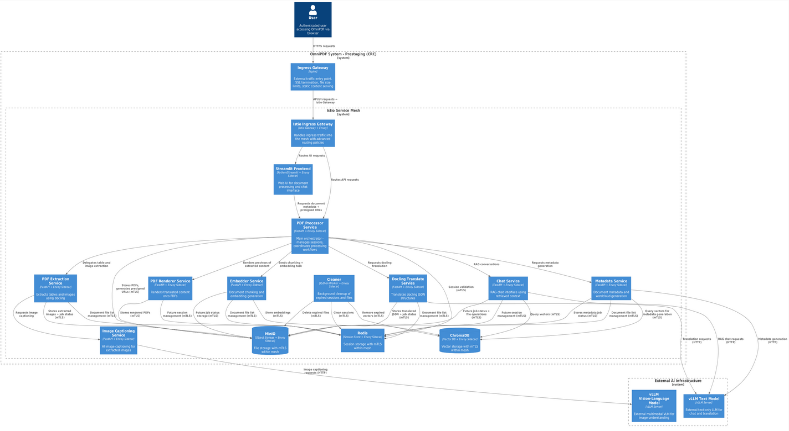

# OmniPDF

> [!NOTE]  
> Thank you for visiting! This project is currently a work in progress. Features, documentation, and deployment configurations are actively being developed and may change frequently.

OmniPDF is a PDF analyzer capable of translation, summarization, captioning and conversational capabilities through Retrieval-Augmented-Generation (RAG). 

## Architecture



OmniPDF follows a **microservices architecture** with **centralized orchestration**:

- **pdf-processor-service**: Main hub that coordinates all processing workflows
- **Processing services**: Specialized services for extraction, translation, rendering, embedding, and chat
- **Data layer**: Redis (sessions), ChromaDB (vectors), MinIO (files)
- **AI/ML layer**: vLLM text and vision-language models
- **Service mesh layer**: Istio for mTLS, traffic management, and observability (prestaging/staging/production)

## Deployment Environments

OmniPDF supports multiple deployment environments with **Kubernetes + Helm**:

- **Development**: Docker Compose for local development
- **Pre-staging**: CodeReady Containers (CRC) with **Istio Service Mesh** + Helm charts
- **Staging**: Offline OpenShift Container Platform (OCP) with **organization's Istio** + Helm
- **Production**: Offline OpenShift Container Platform (OCP) with **organization's Istio** + Helm

**Container Registry Patterns**:
- **Development**: Local Docker images
- **Pre-staging**: `default-route-openshift-image-registry.apps-crc.testing/omnipdf/SERVICE_NAME`
- **Staging/Production**: Internal/disconnected registries (images must be pre-mirrored)

## Quick Start

### Development (Docker Compose)
```bash
# Start all services
docker compose up --build

# Start with GPU support (for LLM services)
docker compose -f docker-compose.gpu.yml up --build
```

### Kubernetes/OpenShift (Helm)
```bash
# Deploy individual service with explicit environment
helm install chat-service ./helm/chat-service \
  --values ./helm/chat-service/values-prestaging.yaml \
  --namespace omnipdf

# Deploy all services using deployment script
./scripts/deploy-helm-charts.sh --all --env prestaging

# Deploy RBAC only (14 individual service roles - should be deployed first)
./scripts/deploy-helm-charts.sh --service rbac --env prestaging
```

### Prestaging with Istio Service Mesh

For prestaging environment in CRC with full service mesh capabilities:

```bash
# 1. Install Istio control plane  
./istio-1.27.1/bin/istioctl install --set values.defaultRevision=default -y

# 2. Create namespace with sidecar injection
oc create namespace omnipdf-prestaging
oc label namespace omnipdf-prestaging istio-injection=enabled

# 3. Deploy Istio Gateway and routing
helm install istio-gateway ./helm/istio-gateway \
  --namespace omnipdf-prestaging \
  --values ./helm/istio-gateway/values-prestaging.yaml

# 4. Deploy RBAC first (individual service roles)
helm install rbac ./helm/rbac \
  --namespace omnipdf-prestaging

# 5. Deploy services with Istio sidecars  
for service in frontend pdf-processor-service chat-service embedder-service chromadb redis minio cleaner pdf-extraction-service docling-translation-service pdf-renderer-service image-captioner-service metadata-service; do
  helm install $service ./helm/$service \
    --namespace omnipdf-prestaging \
    --values ./helm/$service/values-prestaging.yaml
done
```

**Istio Features Enabled:**
- **mTLS**: Automatic mutual TLS between all services
- **Traffic Management**: Intelligent routing and load balancing
- **Observability**: Distributed tracing and metrics
- **Security Policies**: Fine-grained access control

See [`helm/istio-gateway/INSTALL.md`](helm/istio-gateway/INSTALL.md) for detailed setup instructions.

## Security Features

OmniPDF implements **defense-in-depth security** with multiple layers:

### Service Account & RBAC
- **Individual service accounts** for each service with per-service secret isolation
- **14 individual RBAC roles** - one role per service aligned with C4 architecture:
  - `pdf-processor-service-role`, `pdf-extraction-service-role`, `docling-translation-service-role`
  - `embedder-service-role`, `chat-service-role`, `pdf-renderer-service-role`
  - `image-captioner-service-role`, `metadata-service-role`
  - `minio-role`, `chromadb-role`, `redis-role`
  - `frontend-role`, `nginx-gateway-role`, `cleaner-role`
- **Zero-trust security** - each service accesses only required services per C4 diagram
- **Complete audit trail** for inter-service communication

### NetworkPolicy (Zero-Trust)

OmniPDF implements comprehensive zero-trust network policies with explicit service-to-service communication rules:

#### Service Communication Matrix

| Service | **Ingress (Who can call this service)** | **Egress (What this service can call)** |
|---------|----------------------------------------|----------------------------------------|
| **nginx** | • External traffic (users) | • istio-gateway:80/443<br>• DNS resolution |
| **istio-gateway** | • nginx | • frontend:8501<br>• pdf-processor-service:8000<br>• DNS resolution |
| **frontend** | • istio-gateway | • pdf-processor-service:8000<br>• DNS resolution |
| **pdf-processor-service** | • istio-gateway<br>• frontend | • pdf-extraction-service:8000<br>• docling-translation-service:8000<br>• pdf-renderer-service:8000<br>• embedder-service:8000<br>• chat-service:8000<br>• metadata-service:8000<br>• minio:9000<br>• redis:6379<br>• DNS resolution |
| **pdf-extraction-service** | • pdf-processor-service | • image-captioner-service:8000<br>• minio:9000<br>• redis:6379<br>• DNS resolution |
| **docling-translation-service** | • pdf-processor-service | • minio:9000<br>• redis:6379<br>• DNS resolution<br>• HTTP/HTTPS (external vLLM text model) |
| **pdf-renderer-service** | • pdf-processor-service | • minio:9000<br>• redis:6379<br>• DNS resolution |
| **embedder-service** | • pdf-processor-service | • chromadb:8000<br>• minio:9000<br>• redis:6379<br>• DNS resolution |
| **chat-service** | • pdf-processor-service | • chromadb:8000<br>• minio:9000<br>• redis:6379<br>• DNS resolution<br>• HTTP/HTTPS (external vLLM text model) |
| **image-captioner-service** | • pdf-extraction-service | • DNS resolution<br>• HTTP/HTTPS (external vLLM vision model) |
| **metadata-service** | • pdf-processor-service | • chromadb:8000<br>• minio:9000<br>• redis:6379<br>• DNS resolution<br>• HTTP/HTTPS (external vLLM text model) |
| **cleaner** | *No ingress (background service)* | • minio:9000<br>• chromadb:8000<br>• redis:6379<br>• DNS resolution |
| **chromadb** | • embedder-service<br>• chat-service<br>• metadata-service<br>• cleaner | • DNS resolution<br>*No outbound calls* |
| **redis** | • pdf-processor-service<br>• pdf-extraction-service<br>• docling-translation-service<br>• embedder-service<br>• chat-service<br>• pdf-renderer-service<br>• metadata-service<br>• cleaner | • DNS resolution<br>*No outbound calls* |
| **minio** | • pdf-processor-service<br>• pdf-extraction-service<br>• docling-translation-service<br>• pdf-renderer-service<br>• embedder-service<br>• chat-service<br>• metadata-service<br>• cleaner | • DNS resolution<br>*No outbound calls* |

#### Network Policy Configuration

| Environment | NetworkPolicy | Service Mesh | Description |
|-------------|---------------|--------------|-------------|
| **Development** | Disabled | None | Docker Compose - no network restrictions for local dev |
| **Prestaging** | Enabled | **Own Istio** | Zero-trust + mTLS within service mesh |
| **Staging** | Enabled | **Org Istio** | Zero-trust policies + organization's service mesh |
| **Production** | Enabled | **Org Istio** | Strict segmentation + organization's service mesh |

#### Key Architecture Patterns

- **Service Mesh Gateway**: Istio Gateway handles external traffic in prestaging/staging/production
- **API Gateway**: nginx provides application-level routing (development) or internal routing (with Istio)
- **Orchestration Hub**: pdf-processor-service coordinates workflows across processing services  
- **Data Layer Security**: Restricted access to chromadb (vectors), redis (sessions), and minio (files)
- **mTLS Communication**: Automatic mutual TLS between all services in service mesh environments
- **Background Services**: cleaner operates with minimal network permissions for cleanup tasks
- **External Connectivity**: Managed external vLLM/AI API access through ServiceEntry (Istio) or HTTPS egress

### HPA (Horizontal Pod Autoscaler)
- **9 services** with auto-scaling enabled across 3 tiers:
  - **Tier 1 (Critical)**: nginx, pdf-processor-service, chat-service - aggressive scaling (60-70% thresholds)
  - **Tier 2 (Processing)**: pdf-extraction, docling-translation, pdf-renderer - standard scaling (70% thresholds)  
  - **Tier 3 (Burst)**: embedder-service, image-captioner-service, metadata-service - conservative scaling (70% thresholds)
- **High availability**: Minimum 1-2 replicas with scaling up to 5-15 replicas based on service tier
- **Resource optimization**: Proactive scaling for user-facing services, workload-responsive for processing services

## Security Configuration

```bash
# Enable NetworkPolicy for production
helm upgrade chat-service ./helm/chat-service \
  --set networkPolicy.enabled=true \
  --namespace omnipdf

# Check service account permissions
kubectl auth can-i get secrets \
  --as=system:serviceaccount:omnipdf:chat-service \
  -n omnipdf

# Monitor HPA status
kubectl get hpa -n omnipdf
```

## CRC (OpenShift Local) Setup

OmniPDF uses Red Hat CodeReady Containers (CRC) for local OpenShift development. Due to the resource-intensive nature of running 8+ microservices, CRC requires significant CPU and memory allocation.

### Recommended CRC Configuration

#### Quick Setup (Recommended)
```bash
# Run the automated setup script
./config/crc/setup-crc.sh

# Start CRC with configured settings
crc start

# Set up oc environment
eval $(crc oc-env)

# Get login credentials and login
crc console --credentials
oc login -u kubeadmin -p <password> https://api.crc.testing:6443 --insecure-skip-tls-verify
```

#### Manual Configuration
Alternatively, configure CRC manually:

```bash
# Stop CRC if running
crc stop

# Configure CRC resources (adjust based on your system)
crc config set memory 32768     # 32GB RAM (adjust based on your system)
crc config set cpus 12          # 12 CPU cores (adjust based on your system)
crc config set disk-size 120    # 120GB disk (increased for ML workloads)

# Start CRC with new configuration
crc start
```

### Configuration Notes

- **Memory**: 256GB recommended for running all microservices without constraints
- **CPU**: 32 cores provides abundant processing power for OpenShift + services
- **Disk**: 120GB recommended for container images, ML models, and persistent data
- **Configuration saved**: Current settings stored in `config/crc/crc-config.txt`

### Verify Setup

```bash
# Check CRC status
crc status

# Check node resources
oc describe node crc | grep -A 10 "Allocated resources"

# View current configuration
crc config view
```

## Documentation

## Testing

```bash
# Run all service unit tests (206+ tests across 7 services)
./scripts/test-all-services.sh

# Run tests for individual service
./scripts/test-single-service.sh chat_service

# Security scanning with Trivy
./scripts/scan_with_trivy.sh

# Lint all Helm charts
for chart in helm/*/; do helm lint "$chart"; done
```

## Development Workflow

This project uses a `Makefile` to simplify common Helm and Kubernetes operations.

To get started, run:

```bash
make help
```
